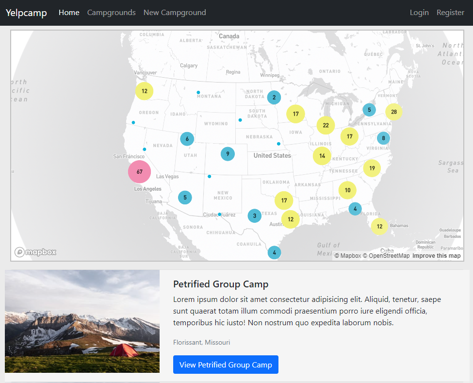

# YelpCamp

## Description
Created by following Colt Steele's "The Web Developer Bootcamp 2023" course on Udemy. Users are able to create accounts, create new campgrounds and leave reviews on existing campgrounds.

## Installation
Clone this repo, install the npm packages, create the environment variables, have MongoDB installed and you are ready to go!

## Usage
Users are able  

## Contribution
to create accounts, create new campgrounds and leave reviews on existing campgrounds.

## License
GNU General Public License

## Questions
User name: dylster1995\
Github: [https://github.com/dylster1995](https://github.com/dylster1995)\
For additional questions you can reach me at dylanyamashiro@gmail.com